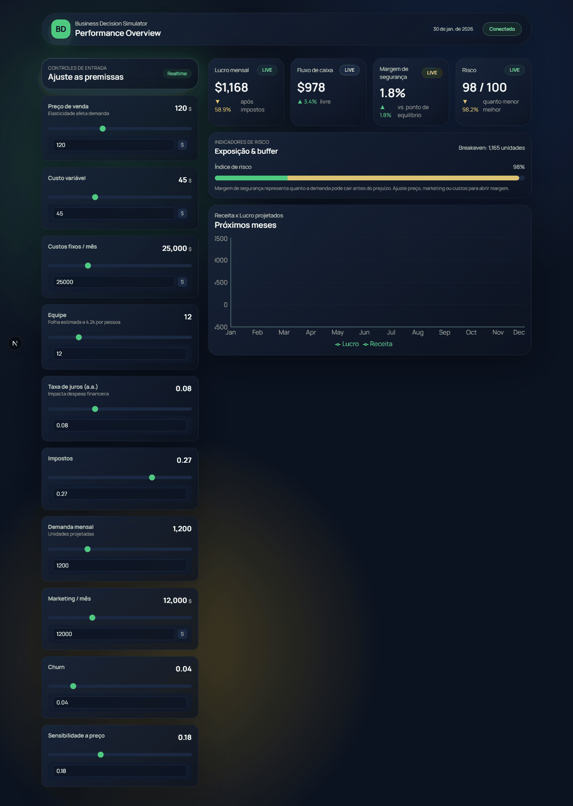

# Business Decision Simulator

Plataforma web interativa para testar decisões estratégicas (preço, custos, marketing, equipe, juros, impostos) e visualizar instantaneamente impacto em lucro, caixa, crescimento e risco.



---

## Destaques
- Atualização em tempo real: sliders e inputs disparam cálculos via WebSocket; se o socket cair, há fallback local para manter a responsividade.
- KPIs e gráficos dinâmicos: lucro, fluxo de caixa, margem de segurança, risco e projeção de receita/lucro nos próximos meses.
- UX inspirada em cockpit financeiro (glassmorphism + gradientes) com layout 2 colunas: controles à esquerda, KPIs/gráficos à direita.
- Engine vetorizada (NumPy/Pandas) para simulações rápidas e fácil extensão de fórmulas.

## Stack
- **Frontend**: Next.js 16, React 19, Tailwind 3, Recharts, Playwright (screenshot demo).
- **Backend**: FastAPI, WebSocket, Pydantic v2, SQLAlchemy (models), JWT stub.
- **Engine**: NumPy + Pandas (cálculo de lucro, caixa, risco, crescimento).
- **DB**: PostgreSQL (models prontos; persistência futura).

## Arquitetura (visão rápida)
- `frontend/` — UI, componentes (sliders, KPIs, chart), estado via `useSimulationState` (WebSocket + debounce).
- `backend/app/main.py` — FastAPI + rota WS `/ws/simulate`.
- `backend/app/simulation/engine.py` — motor de cálculo vetorizado.
- `backend/app/api/routes/` — auth demo (JWT), cenários mock e health.

## Como rodar localmente
### Backend
```bash
cd backend
python -m venv .venv
. .venv/Scripts/activate   # Windows
pip install -r requirements.txt
uvicorn app.main:app --reload --host 0.0.0.0 --port 8000
```

### Frontend
```bash
cd frontend
npm install
npm run dev -- --hostname 0.0.0.0 --port 3000
```

O frontend espera `ws://localhost:8000/ws/simulate`. Para apontar para outro host/porta, defina `NEXT_PUBLIC_WS_URL`.

## Endpoints úteis
- `GET /api/health` — liveness.
- `POST /api/auth/login` — emite JWT de demonstração (sem persistência).
- `GET /api/scenarios` — cenários mock.
- `POST /api/scenarios/run` — executa simulação on-demand (JSON de variáveis).
- `WS /ws/simulate` — envia variáveis, recebe KPIs e séries.

## Variáveis simuladas (payload)
```json
{
  "price": 120,
  "variable_cost": 45,
  "fixed_cost": 25000,
  "employees": 12,
  "interest_rate": 0.08,
  "tax_rate": 0.27,
  "demand": 1200,
  "marketing_spend": 12000,
  "churn_rate": 0.04,
  "price_sensitivity": 0.18,
  "period_months": 12
}
```

## Scripts úteis
- Frontend: `npm run dev`, `npm run lint`.
- Backend: `uvicorn app.main:app --reload`.

## Próximos passos sugeridos
- Persistir usuários/cenários (PostgreSQL + Alembic) e proteger WS com JWT.
- Rate limiting no WS + debounce configurável.
- Testes automatizados: PyTest (engine), React Testing Library / Playwright (UI).
- Migração para ambiente de produção (build Next + gunicorn/uvicorn workers).

## Sobre o GIF
O arquivo `docs/demo.gif` foi gerado a partir da UI atual. Para recriar:
1) Inicie frontend e backend (`npm run dev` + `uvicorn ...`).  
2) Gere o PNG: `cd frontend && node scripts/screenshot.js` (usa Playwright headless).  
3) Converta para GIF:  
```bash
python - <<'PY'
from PIL import Image
img = Image.open('docs/demo.png')
img.save('docs/demo.gif', save_all=True, append_images=[img], duration=1200, loop=0)
PY
```  
4) Faça o commit: `git add docs/demo.gif`.
